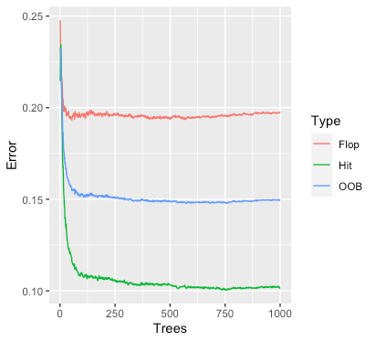

# Random-Forest-
Predicting hit songs with a random forest in R

**Goal of the Project**: Predict whether a song would be a hit or a flop by
examining audio features of songs from 1960-2019.

The following table describes the dataset attributes:
 
| Name             | Type      | Description                                                                 |
|------------------|-----------|-----------------------------------------------------------------------------|
| Track            | character | The name of the track.                                                      |
| Artist           | character | The name of the Artist.                                                     |
| Uri              | character | The Spotify url for the track.                                              |
| Danceability     | double    | Describes how suitable a track is for dancing. 0 to 1 indicates Low to High |
| Energy           | double    | Measure of intensity and activity. 0 to 1 indicates Low to High             |
| Key              | integer   | The key of the track. 0 to 11 indicates C note to B note                    |
| Loudness         | double    | Loudness of track in decibels                                               |
| Mode             | integer   | Modality(Major or Minor) of a track                                         |
| Speechiness      | double    | Presence of Spoken words in a track. 0 to 1 indicates Low to High           |
| Acousticness     | double    | Measure of the acousticness of track. 0 to 1 indicates Low to High          |
| Instrumentalness | double    | Likelihood of a track containing no vocals. 0 to 1 indicates Low to High    |
| Liveness         | double    | Presence of an audience in the recording.0 to 1 indicates Low to High       |
| Valence          | double    | Musical positiveness conveyed by a track. 0 to 1 indicates Low to High      |
| Tempo            | double    | Tempo of a track in BPM(Beats per Minute)                                   |
| Duration_ms      | integer   | Duration of the track in milliseconds                                       |
| Time_signature   | integer   | Overall time signature of a track (1,2,3,4 or 5)                            |
| Chorus_hit       | double    | Timing of the start of chorus                                               |
| Sections         | integer   | Number of sections of a particular track                                    |
| Target           | integer   | Whether the track is a hit (1) or not (0)                                   |

RANDOM FOREST

Since a decision tree can encounter over-fitting issues and it can also ignore explanatory predictors when there&#39;s a small sample size and a large p-value, I decided to create a random forest model and put it to the test.

Method:

For this model, I didn&#39;t had to partition the dataset into training and validation sets since the random forest pick a sample with replacement from the dataset as its training set for every individual tree. Those not considered in the training set for a specific tree are going to be used later on to test the prediction power. The records that were not used to build a tree are referred to as Out-Of-Bag (OOB).

At first, I ran the model with the default values (number of trees 500, variables to consider at each splitting node 4) for the whole database. I ended up getting an OOB error of 19.01%, which translates into 80.99% of accuracy. It came to my mind that maybe different tastes for music along the decades could be canceling the effects from the predictors to the target variable (the characteristics that made a hit in the 60s might be different from those in the 2010s).

Since we are trying to predict a hit or a flop as for today, and we also know that the more data the better (as long as it doesn&#39;t contain errors or misleading info like it could be from other decades taste for songs), I decided to try the latest data adding the following decade each time and looking for the accuracy behavior.

We got:

| **Considered data** | **OOB Error** |
| --- | --- |
| 2010s | 15.49 % |
| 2010s and 2000s | 15.04 % |
| 2010s, 2000s and 1990s | 14.9% |
| 2010s,2000s, 90s and 80s | 16.51 % |

We can notice that when considering the 80s, a lot of noise and confusion was added to the model, losing prediction power. So, I consider utilizing only the data conformed from the 90s, 2000s, and 2010s.

As for the next step, I searched for a proper number of trees to consider. To do so, I plotted the Out-of-Bag errors by the number of trees considered in the model. As we can see in FIG1. 500 trees look to be a good number of trees since the errors are not decreasing anymore in a meaningful way, it looks like by 500 trees we are already observing convergence.

Then, we search for the optimal number of variables to consider at each split.

To do so, I computed the OOB errors when considering 1 variable all the way to 10 variables.

The results were as follows:

| Number of variables considered per split | OOB Error |
| --- | --- |
| 1 | 0.1644744 |
| 2 | 0.1514896 |
| 3 | 0.1495784 |
| 4 | 0.1489601 |
| 5 | 0.1494098 |
| 6 | 0.1505902 |
| 7 | 0.1490163 |
| 8 | 0.1522203 |
| 9 | 0.1507026 |
| 10 | 0.1516582 |

So, as we can observe considering 4 variables as suggested by default (considering the square root of your predictors) for splitting at each node was in fact the optimal since it brings the lowest OOB error. But we wouldn&#39;t be able to know unless trying for different values.

Result:

In conclusion, in this prediction model, we generated a random forest that involves generating 500 decision trees which will evaluate any new song characteristics, and then the result will be the majority vote of these all 500 trees&#39; decisions. It considers 4 random variables at each splitting node, and it presents an overall OOB error of 14.9% (85.1% accuracy).

We can observe the confusion matrix in FIG2 to notice that the overall OOB error comes from a 19.43% error from wrongly predicting flops and a 10.37% error from wrongly predicting hits.

As for the predictor&#39;s importance, I plotted their permutation importance in FIG 3 which clearly highlights instrumentalness as the most important factor. Just for interpretation purposes, the way these values are determined comes from permuting all the OOB values from a predictor (so you break the real relationship with the target) and then try them with each tree. If the error after permuting the predictor&#39;s values doesn&#39;t increase significantly, then it means that the variable wasn&#39;t very important. Then the difference between the error from the real data and the permuted data for a specific predictor is going to be averaged across all trees and normalized by the standard deviation of the differences. So, in the end, the variables with the higher difference between errors (Highest decrease of accuracy) are going to be the most important for our model.

FIG1.

FIG 2

FIG 3

Data Source:
<https://www.kaggle.com/theoverman/the-spotify-hit-predictor-dataset>
